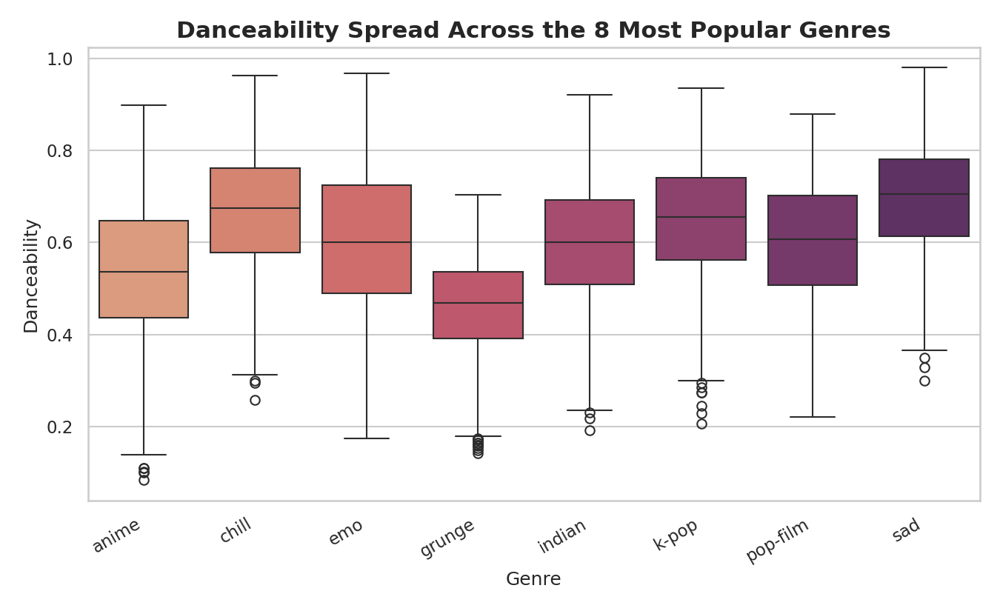
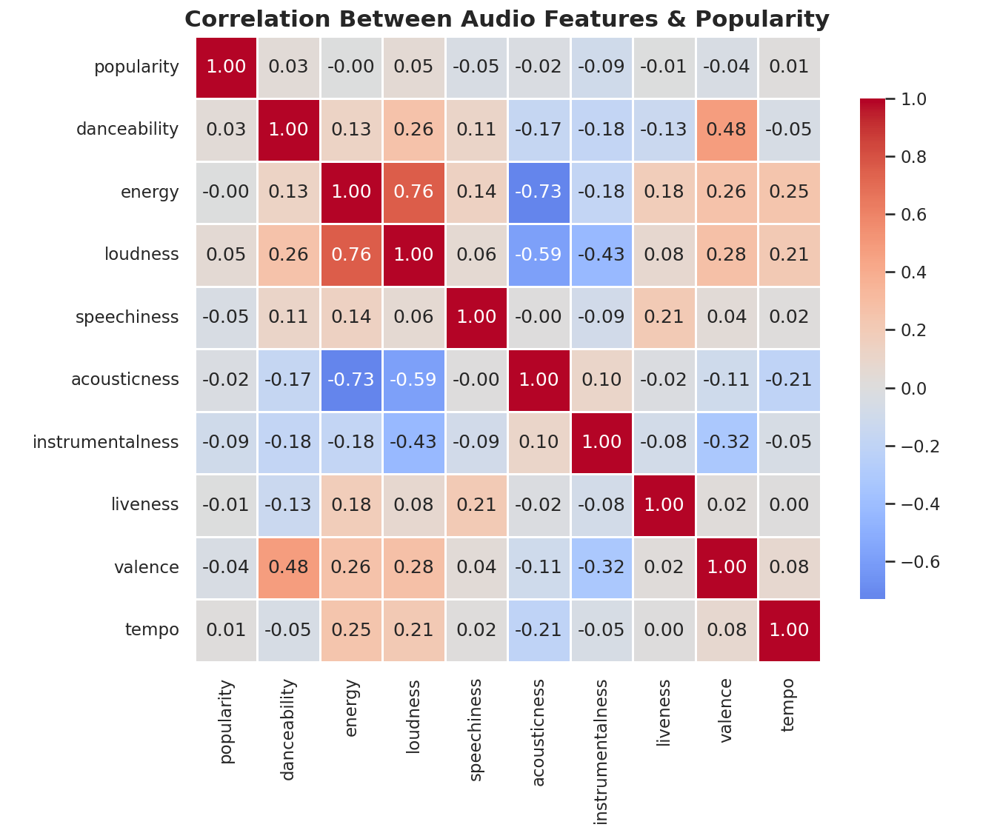
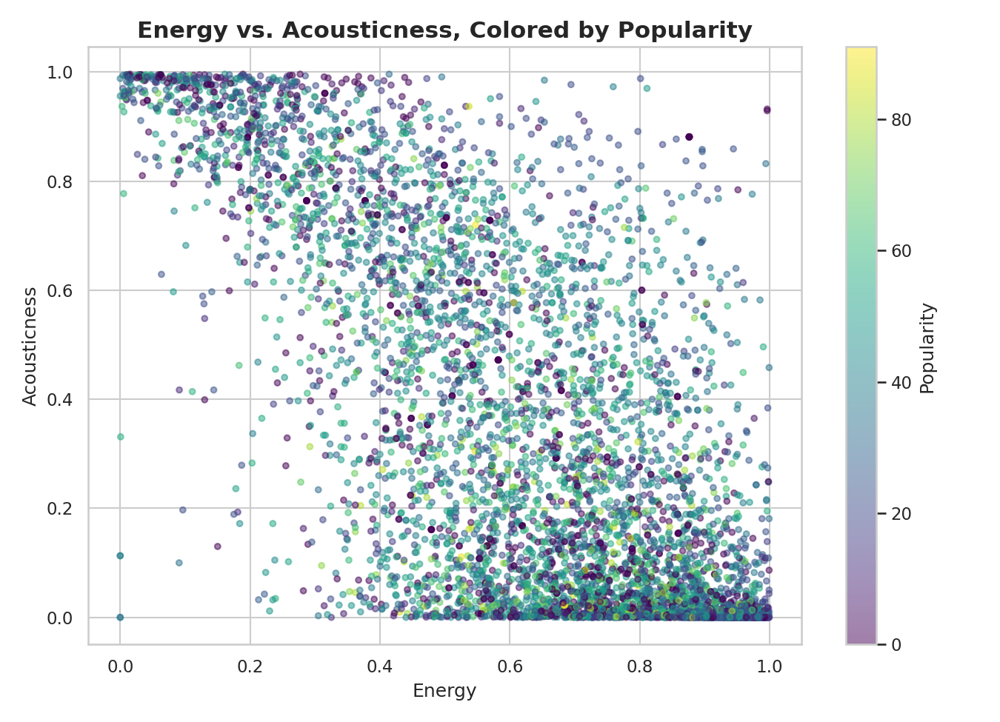
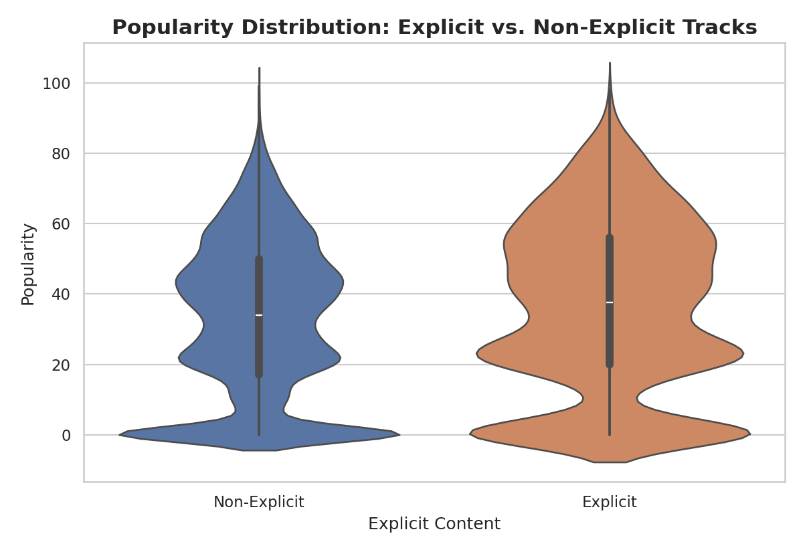
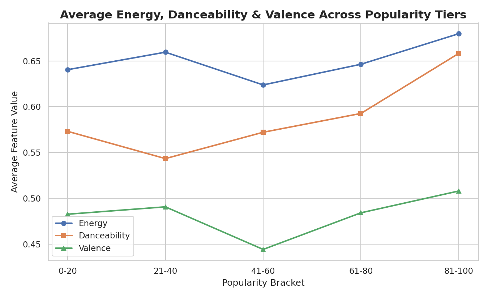

# Spotify Tracks Dataset — EDA & Data Storytelling

Exploratory data analysis and visual storytelling on the [Spotify Tracks Dataset](https://www.kaggle.com/datasets/maharshipandya/-spotify-tracks-dataset) (Maharshi Pandya, Kaggle), performed in `visualization.ipynb`.

## Dataset Overview

- **114,000 tracks** across **114 genres** (1,000 tracks sampled per genre), pulled from Spotify's Web API.
- **20 columns**: track metadata (`track_id`, `artists`, `album_name`, `track_name`, `track_genre`) and Spotify's own audio features (`popularity`, `duration_ms`, `explicit`, `danceability`, `energy`, `key`, `loudness`, `mode`, `speechiness`, `acousticness`, `instrumentalness`, `liveness`, `valence`, `tempo`, `time_signature`).
- **Cleaning:** 1 row with missing metadata and 450 fully duplicated rows were dropped, leaving 113,549 rows for analysis.

## Visualizations

All charts are built with Matplotlib and Seaborn. Six chart types are used across seven visualizations: **histogram, bar chart, box plot, heatmap, scatter plot, violin plot, and line chart.**

### 1. Distribution of Track Popularity (Histogram)

**Insight:** Popularity is heavily right-skewed with a large spike near 0 — over 14,000 tracks score a popularity of 0. Most catalogued tracks get little play, while a small share of tracks attracts most of the attention.

### 2. Top 15 Genres by Average Popularity (Bar Chart)

**Insight:** `pop-film` (59.3), `k-pop` (57.0), and `chill` (53.7) top the genre rankings by average popularity, while `iranian` (2.2), `romance` (3.5), and regional house/techno genres sit at the bottom. Mainstream, playlist-friendly genres clearly out-perform niche or regionally-specific ones.

### 3. Danceability Spread Across the 8 Most Popular Genres (Box Plot)

**Insight:** Among the most popular genres, `sad` and `chill` have the highest median danceability (~0.66–0.69) despite their names suggesting low-energy listening. `grunge` sits lowest (~0.46) with the widest spread, reflecting its guitar-driven, irregular rhythmic feel.

### 4. Correlation Between Audio Features & Popularity (Heatmap)

**Insight:** The strongest relationships are between audio features themselves, not popularity: `energy` and `loudness` correlate at **+0.76**, and `energy` and `acousticness` correlate at **-0.73**. `danceability` and `valence` show a moderate positive link (**+0.48**). Popularity has no strong linear driver among these audio features (all correlations below |0.10|).

### 5. Energy vs. Acousticness, Colored by Popularity (Scatter Plot)

**Insight:** The inverse relationship between energy and acousticness shows up as a clear diagonal band — tracks cluster as either high-energy/low-acoustic or low-energy/high-acoustic. Higher-popularity tracks are scattered across the whole band, so popularity isn't concentrated in one energy/acousticness combination.

### 6. Popularity Distribution: Explicit vs. Non-Explicit Tracks (Violin Plot)

**Insight:** Explicit tracks average a slightly higher popularity (**36.5**) than non-explicit tracks (**33.0**). Both groups share the same long tail of zero-popularity tracks, but the explicit group's mass sits a bit higher, consistent with explicit content skewing toward hip-hop/pop genres that chart more heavily on streaming.

### 7. Average Energy, Danceability & Valence Across Popularity Tiers (Line Chart)

**Insight:** Moving from the lowest to the highest popularity brackets, average energy and danceability both trend upward, while valence stays comparatively flat. The most popular tracks are, on average, noticeably more energetic and danceable than the least popular ones.

## Overall Conclusions

- **Popularity is heavily skewed**, with a large share of tracks scoring 0 — success is concentrated in a small fraction of the catalogue.
- **Genre matters far more than any single audio feature.** Popularity by genre ranges from ~2 to ~59, while every individual audio feature correlates with popularity at under |0.10|.
- **Audio features behave in musically sensible, internally consistent ways** (energy–loudness, energy–acousticness, danceability–valence), even though they don't directly explain popularity.
- **Explicit content and higher energy/danceability show mild positive association with popularity**, but neither is a strong standalone predictor.
- **Practical takeaway:** a model built purely on Spotify's audio features is unlikely to predict popularity well — genre, artist recognition, and platform/marketing factors likely matter more, and should be incorporated in any predictive follow-up work.

